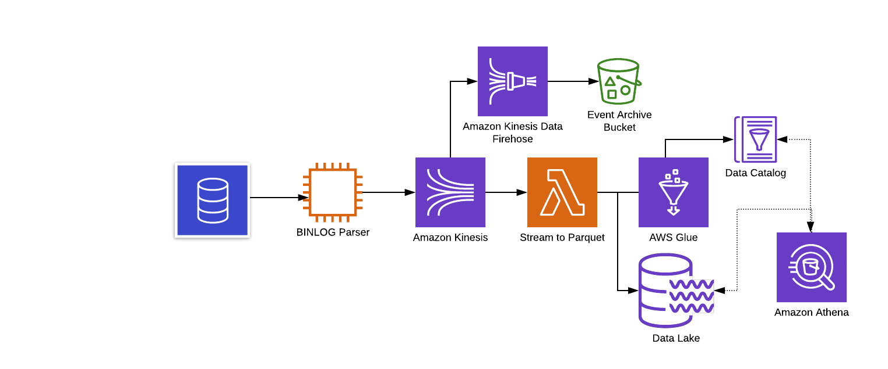
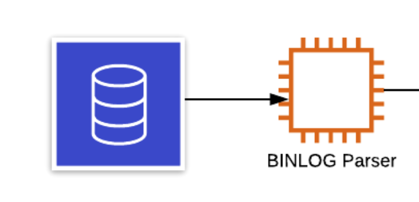
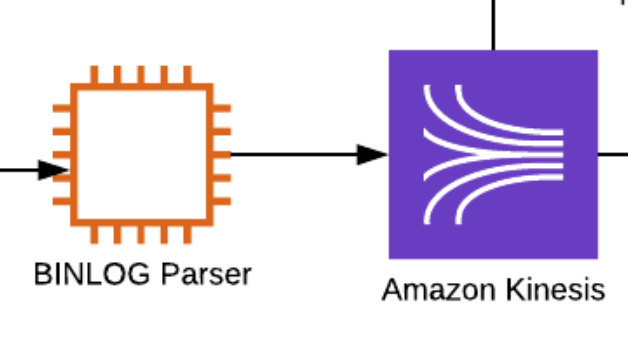
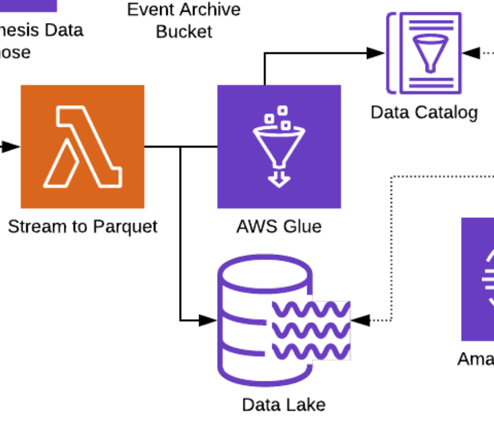
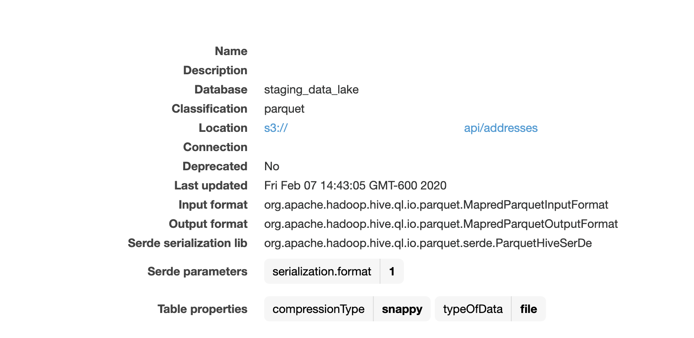
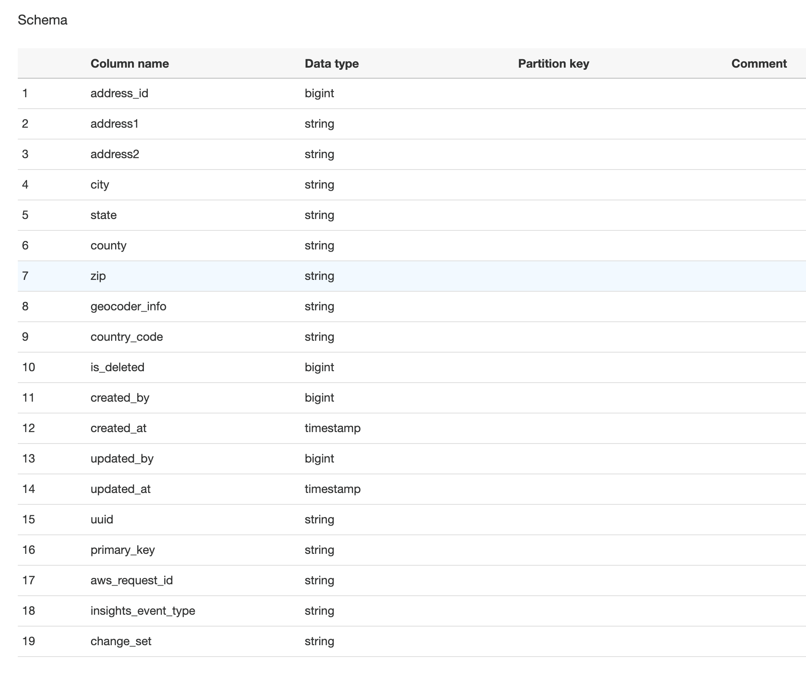
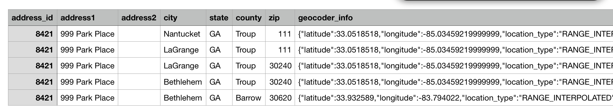
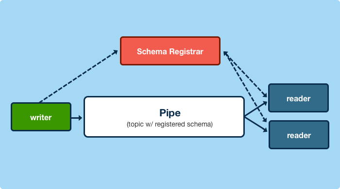
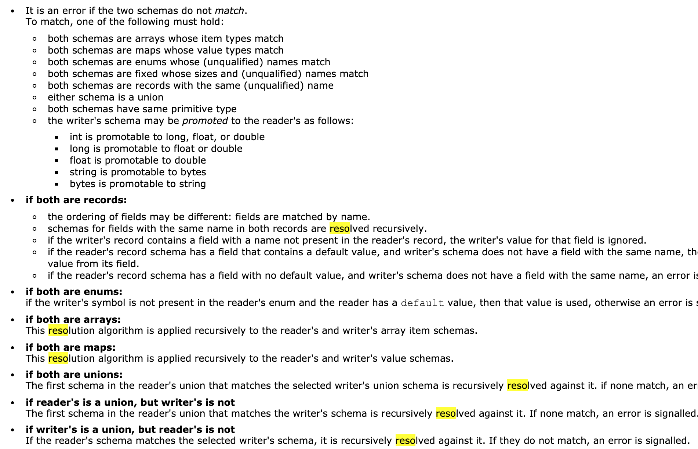

# Building History from MySQL

---


---



---



---

# BIN LOG

- `pip install mysql-replication`

- `GRANT REPLICATION SLAVE, REPLICATION CLIENT, SELECT ON *.* TO 'username'@'host'`

---

```python
MYSQL_SETTINGS = {
    "host": "mysql-server.some-domain.com",
    "port": 3306,
    "user": 'username',
    "passwd": 'password'
}
```

---

```python
def main():
    # server_id is your slave identifier, it should be unique.
    # set blocking to True if you want to block and wait for the next event at
    # the end of the stream
    stream = BinLogStreamReader(
        connection_settings=MYSQL_SETTINGS,
        server_id=1337,
        blocking=True,
        only_events=[
            DeleteRowsEvent, 
            WriteRowsEvent, 
            UpdateRowsEvent
        ]
    )

    for binlogevent in stream:
        binlogevent.dump()

    stream.close()
```

---

```shell
=== TableMapEvent ===
Date: 2020-02-18T14:27:58
Log position: 28649
Event size: 65
Read bytes: 63
Table id: 91221
Schema: staging_api
Table: activity_feed
Columns: 11
```

---

```shell
=== WriteRowsEvent ===
Date: 2020-02-18T14:27:58
Log position: 28761
Event size: 89
Read bytes: 13
Table: staging_api.activity_feed
Affected columns: 11
Changed rows: 1
Values:
--
* activity_feed_id : 2630701
* loan_id : None
* crud : read
* model : Loans/LoanDraft
* primary_key : 44206
* user_role : branchAdministrator
* is_deleted : 0
* created_by : 15016
* created_at : 2020-02-18 20:27:58.992000
* updated_by : 15016
* updated_at : 2020-02-18 20:27:58.992000
```
---

```
=== QueryEvent ===
Date: 2020-02-18T14:28:13
Log position: 28947
Event size: 67
Read bytes: 67
Schema: b'staging_api'
Execution time: 0
Query: BEGIN
```

---

```
=== UpdateRowsEvent ===
Date: 2020-02-18T14:28:42
Log position: 30127
Event size: 293
Read bytes: 23
Table: staging_api.inspections
Affected columns: 41
Changed rows: 1
Affected columns: 41
Values:
--
*inspection_id:23151=>23151
*is_deleted:0=>0
*created_by:12396=>12396
*created_at:2020-02-17 20:29:32.225000=>2020-02-17 20:29:32.225000
*updated_by:12396=>12396
*updated_at:2020-02-17 20:29:32.277000=>2020-02-18 20:28:42.760000
*field_inspector_id:None=>None

```
---


---


---



---
```python
@dataclass
class ServiceEvent:
    source: str
    type: str
    data: dict
    aws_request_id: str
    version: int = field(default=1)
    event_date: str = field(default_factory=lambda: datetime.utcnow().isoformat())
    uuid: str = field(default_factory=lambda: str(uuid4()))
```

---

```python
event_list.append(
    ServiceEvent(
        source=type(elem).__name__.lower(),
        type='create',
        data=row2dict(elem),
        aws_request_id='test_id',
        user_id=user_id,
        version=2,
    )
)
```
---
```python
for event in event_list:
    records_list.append(
        {"Data": event.to_json(), 
        "PartitionKey": partition_key
        }
    )

for records_list in chunk_records(records, 500):
    try:
        kinesis_client.put_records(
            Records=records_list, 
            StreamName=environ.get("KINESIS_STREAM")
        )
```
---



---

AWS Data Wrangler

- `pip install awswrangler`
- `pip install fastparquet`

---

```python
database_name = f'data_lake'
table_name = f'{source}_{data_model}'
session = awswrangler.Session(region_name='us-east-1')
session.pandas.to_parquet(
    dataframe=event_df,
    database=database_name,
    table=table_name,
    cast_columns=cast_dict_parquet,
    path=s3_path,
    preserve_index=False,
    inplace=True,
)
```

^ Put the data into a dataframe

---



---



---



---


---

# Oh yeah...  :poop:  just got real

---

# Schema Migrations

- Default all new data to strings, and gradually fix types
- Write the schema to Kinesis (Apache AVRO, ProtoBufs)

---

```python
def build_data_dict(tables: List, db_meta) -> Dict:
    data_dict: Dict = {"athena": {}, "python": {}}
    for table in tables:
        for column in db_meta.tables[table].c:
            if "TINYINT" in str(column.type):
                data_dict["athena"][column.name] = "bigint"
                data_dict["python"][column.name] = "int"
                continue
            if column.name == "primary_key":
                data_dict["athena"][column.name] = "string"
                data_dict["python"][column.name] = "str"
                continue
            try:
                data_dict["athena"][column.name] = python2athena(
                    column.type.python_type
                )
                data_dict["python"][column.name] = sql2python(column.type.python_type)
            except TypeError as exc_info:
                LOGGER.error(
                    "Failed to determine type for %s with message: %s",
                    column.name,
                    str(exc_info),
```

---

```python
TYPE_MAP = {
    "<class 'int'>": {"athena": "bigint", "python": "int"},
    "<class 'float'>": {"athena": "double", "python": "float"},
    "<class 'decimal.Decimal'>": {"athena": "double", "python": "float"},
    "<class 'bool'>": {"athena": "bigint", "python": "int"},
    "<class 'str'>": {"athena": "string", "python": "str"},
    "<class 'datetime.datetime'>": {
        "athena": "timestamp",
        "python": "datetime.datetime",
    },
    "<class 'datetime.date'>": {"athena": "date", "python": "datetime.datetime"},
    "<class 'bytes'>": {"athena": "bytes", "python": "bytes"},
    "<class 'dict'>": {"athena": "string", "python": "str"},
}
```

---

```python
def python2athena(python_type: type) -> str:
    python_type_str: str = str(python_type)
    if python_type_str in TYPE_MAP:
        return TYPE_MAP[python_type_str]["athena"]

    raise TypeError(f"Unsupported Athena type: {python_type_str}")
```

---

```python
s3_fs = s3fs.S3FileSystem()
file_accum = []
for file_name in files:
    table = parquet.read_table(f"s3://{bucket_name}/{file_name}", filesystem=s3_fs)
    table_data_frame = table.to_pandas()
    file_accum.append(table_data_frame)
data_frame = pandas.concat(
    file_accum, keys=range(1, len(file_accum) + 1), sort=False
).reset_index(level=1, drop=True)
return data_frame
```
---

```python
wrangler = awswrangler.Session()
group_files = wrangler.pandas.to_parquet(
    dataframe=data_frame,
    database=data_lake,
    table=f"{table_source.replace('-', '_')}_{table_name.replace('-', '_')}",
    preserve_index=False,
    mode='append',
    cast_columns=cast_types,
    procs_cpu_bound=1,
    procs_io_bound=1,
    inplace=True,
    path=f"s3://{bucket_name}/{table_source}/{table_name}",
)
```

---



---



---

# Short Version of AVRO + JAM RULE

- Don't rename columns
- Don't change column types
- Don't repurpose a column or a feature flag (Knight Capital Group)

---

# Thank you
